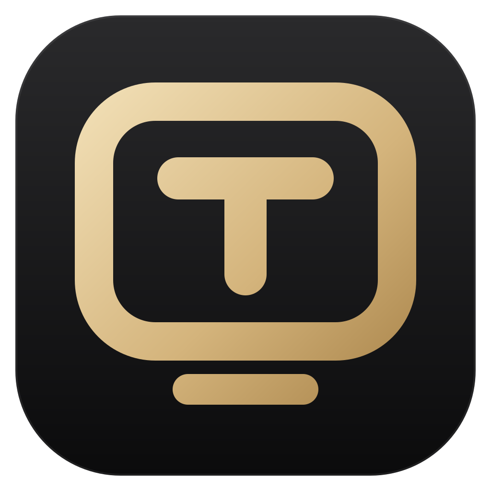
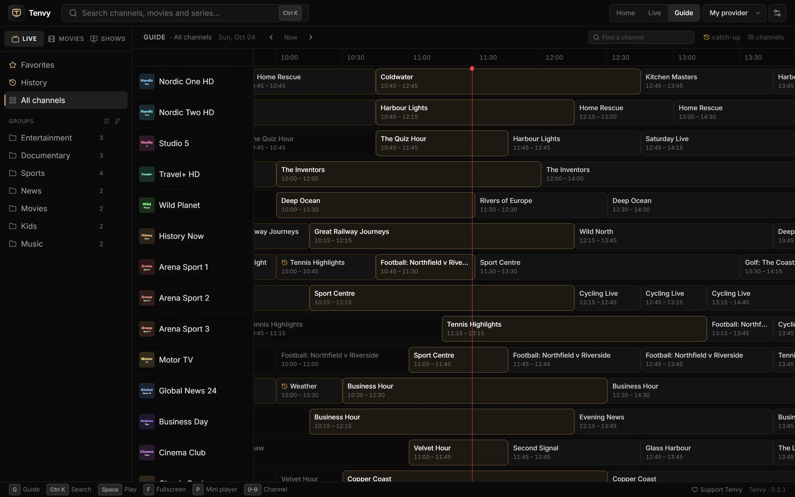
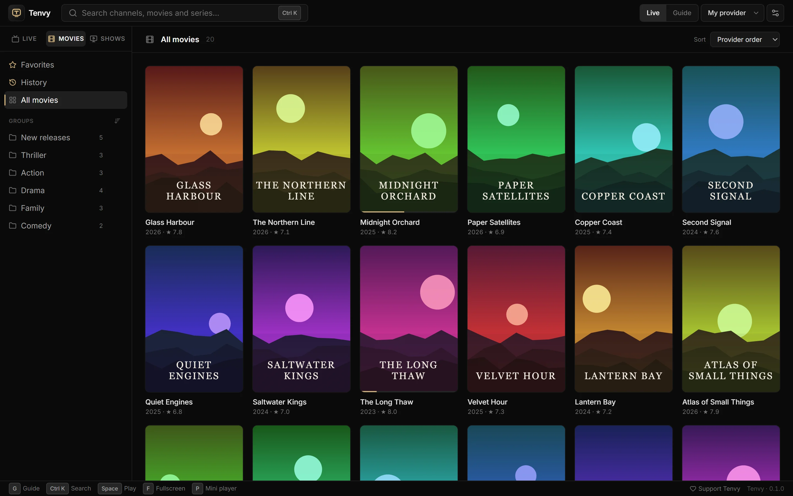
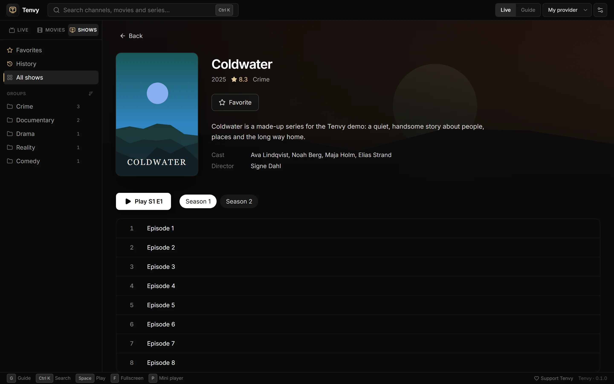

  

<h1 align="center">Tenvy – IPTV Player for Windows</h1>

  <b>Your IPTV, beautifully organised.</b> 
  Live TV with a real programme guide and catch-up, movies and series with artwork — free.

  <a href="https://github.com/quph4/tenvy-releases/releases/latest"><b>⬇ Download for Windows</b></a>
  &nbsp;·&nbsp;
  <a href="https://quph4.github.io/tenvy-releases/">Website</a>

## Features

- **A proper TV guide** — what's on across every channel, a week back and forward.
- **Catch-up & start over** — watch from the beginning, or programmes that already aired (where your provider archives them).
- **Movies & series** — a poster library with ratings, plots, trailers, seasons and "continue watching".
- **Instant search** — <kbd>Ctrl</kbd>+<kbd>K</kbd> finds any channel, film or show as you type.
- **Reminders** — get a nudge a minute before the match starts.
- **Mini player** — the game in a small always-on-top window (<kbd>P</kbd>).
- **Updates itself** — signed updates, one click.

Works with **Xtream Codes** logins, **M3U/M3U8** playlists and **XMLTV** guides.

| Library | Series |
| --- | --- |
|  |  |

## Install

1. [Download the latest version](https://github.com/quph4/tenvy-releases/releases/latest) — `Tenvy_<version>_x64-setup.exe`.
2. Run it. No admin rights needed.
3. If Windows shows *"Windows protected your PC"*, click **More info → Run anyway**. (New apps get this until they've built up a reputation with Microsoft.)
4. Paste the login or link from your IPTV provider.

Windows 10 and 11, 64-bit.

## Free

Questions, ideas or problems? Join the [Tenvy Discord](https://discord.gg/WxShS8pgzR).

Tenvy is free, with no account, ads or tracking. If you enjoy it, you can support its development from the app (Settings → About) or the website.

---

Tenvy is a media player and does not provide any content. It includes no channels, streams or other media — you connect a service you already have. Use it only with services and streams you have the right to watch.

This repository hosts Tenvy's releases, website and update feed (`releases/latest/download/latest.json`, `config.json`).
